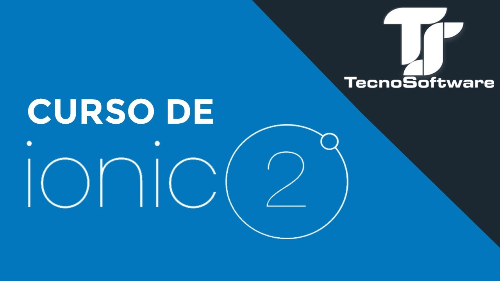

  
  ### 🙋🏽‍♂️ José Salazar
  
  Web Developer & Mentor

  
  
  
  

## 🛠️ Tech stack

Some of the technologies and tools that I love and use

## 👨🏽‍💻 Courses/Tutorials/Posts

Some of the online content that I have created.

#### 🟢 Curso de Ionic 2 - TecnoSoftware

